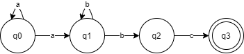

# Automato Finito Indeterministico

Codigo representativo de um **Automato Finito Indeterministico**

## Compilação

Para compilar esse arquivo é necessario usar a linha de codigo

```g++ main.cpp -o "nome para o arquivo"```

## Funcionamento

O codigo fornece ao usuario um meio de montar um automato finito entao ele, por pedido, necessita de:


- Estados iniciais
- Estados finais
- Funções de transição


Primeiramente o usuario insere um vetor de ate 50 caracteres para serem os **Estados Iniciais**. Para simplificar o exemplo tera apenas como caractere inicial:

```a```

Apos isso são pedidos os **Estados finais**. No exemplo será:

```c```

Entao será perguntado quantas **Funções de transição** terão o automato sem contar as que levam para o estado final. Será colocado :

```4```

Logo apos, iniciará um loop para que as funçoes sejam criadas. Dentro do codigo cada função é uma estrutura com:

-Estado atual: Representando sua origem

-Valor: Representando seu caractere valido

-Estado final: Representando seu destino

Com as funções especificadas será criado esse automato:



Por fim o usuario pode entrar com palavras para serem verificadas e serao mostrados os passos e se ocorreu algum problema onde esse problema foi encontrado.
